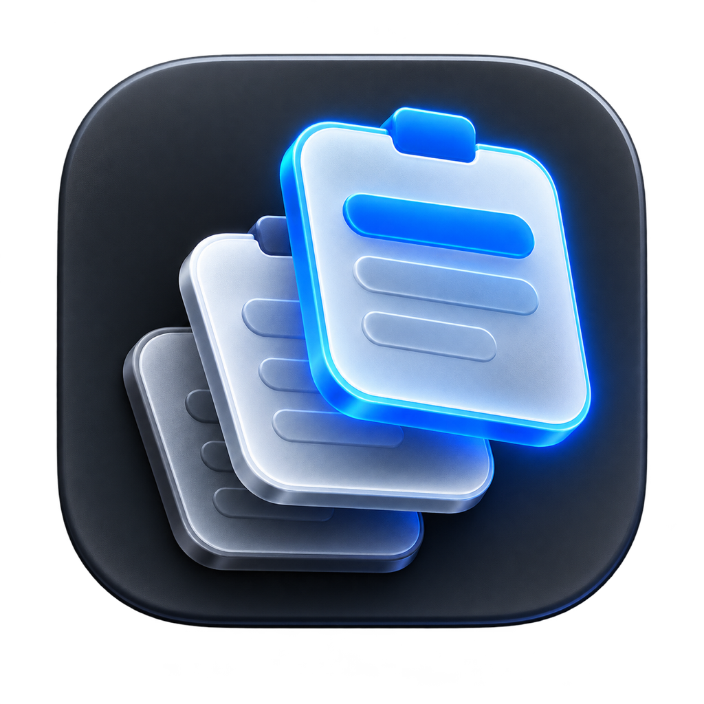

# Pilp

<p align="center">
  
</p>

Pick it. Paste it your way.

Pilp is an open-source macOS clipboard picker. It watches copied text and images, then opens a fast horizontal picker from a shortcut you choose.

> Pilp is under active development. With Pilp access enabled, Return pastes the selected clip into the active app. Without access, Pilp copies it so you can press `Command-V` once.

## Distribution

Pilp supports macOS only. Official builds are published exclusively through [GitHub Releases](https://github.com/kakjzi/Pilp/releases). Pilp is not distributed through the Mac App Store, and Windows or Linux versions are not planned.

Early Alpha builds are ad-hoc signed and not notarized while the project is being validated. macOS will warn before opening one of these builds. Only download Pilp from this repository.

## Languages

Pilp includes English and Korean in the same app. It automatically follows the preferred language selected for Pilp in macOS **System Settings → General → Language & Region → Applications**.

### 한국어 안내

Pilp는 macOS용 오픈소스 클립보드 선택 도구입니다. 같은 설치 파일에 한국어와 영어가 모두 포함되어 있으며 Mac의 앱 언어 설정을 자동으로 따릅니다.

1. [GitHub Releases](https://github.com/kakjzi/Pilp/releases)에서 **Pre-release**로 표시된 ZIP을 내려받습니다.
2. 압축을 풀고 `Pilp.app`을 응용 프로그램 폴더로 옮깁니다.
3. Apple에 등록되지 않은 Alpha 버전이므로 최초 실행이 막히면 **시스템 설정 → 개인정보 보호 및 보안 → 보안 → 확인 없이 열기**를 선택합니다.
4. `⌘V 길게 누르기`를 사용하려면 처음 나타나는 안내에 따라 **개인정보 보호 및 보안 → 기기 제어 및 데이터 접근**에서 Pilp를 켭니다. Pilp는 권한 변경을 자동 감지하므로 재실행할 필요가 없습니다.
5. `⌘V`를 짧게 누르면 평소처럼 바로 붙여넣고, 길게 누르면 선택 창이 열립니다. ← → 키로 고른 뒤 Return을 누르면 선택 항목을 바로 붙여넣습니다. Pilp 권한이 없을 때는 선택 항목만 복사하므로 ⌘V를 한 번 누르세요.

## What works

- Watches text, PNG, and TIFF clipboard changes while Pilp is running
- Opens a floating picker from a user-recorded global shortcut
- Opens the picker when Command-V is held, while a quick Command-V still pastes normally
- Opens a short setup guide on first launch
- Shows five recent clips in a movable horizontal ribbon near the bottom of the active screen
- Shows the source app and capture time for each clip
- Moves through clips with the left and right arrow keys
- Pastes plain text with Return and preserves RTF or HTML formatting with Shift-Return
- Falls back to plain text when an original rich representation is unavailable
- Previews copied images up to 20 MiB each
- Keeps total in-memory image history under 80 MiB by removing the oldest images first
- Keeps pinned clips ahead of the newest unpinned clips for the current session
- Moves a copied duplicate back to the front
- Ignores blank text and trims history to the latest 10 clips
- Shows search after six clips and matches text or the source app name
- Deletes one clip or clears the whole in-memory history
- Pauses capture for five minutes and supports persistent app exclusions
- Can launch automatically when you log in to macOS
- Stores history in memory only and clears it when the app quits
- Checks GitHub Releases for updates manually or automatically with Sparkle
- Can download verified updates in the background and install them through the standard macOS update flow
- Displays its interface in Korean or English from the same app bundle

## Use Pilp

1. Open `Pilp.app`. The first-launch guide appears and a Pilp icon is added to the macOS menu bar.
2. When macOS asks, enable Pilp under **Privacy & Security → Device Control & Data Access**. Pilp detects the permission change automatically, without a restart. It uses access only to distinguish a quick `Command-V` from a hold and to replay a normal paste.
3. Optionally record a separate global shortcut in the guide.
4. In **Updates**, choose whether Pilp should check for and download new versions automatically.
5. Copy text or an image as usual with `Command-C`.
6. Tap `Command-V` to paste normally, or hold it for about half a second to open Pilp. You can also use your custom shortcut or choose **Show Picker** from the menu bar icon.
7. Press `Left Arrow` or `Right Arrow` to choose a clip. After six clips, use the search field to filter by text or source app. Pin important clips or press Delete to remove one.
8. Press `Return` to paste text without formatting. Press `Shift-Return` to preserve the captured RTF or HTML formatting. `Escape` closes the picker. Without Pilp access, either action copies the clip and you can tap `Command-V` in the destination app.
9. Use the menu bar to pause capture for five minutes, clear history, or open Settings. Settings includes app exclusions and Launch at Login.

## Install an unsigned Alpha

1. Download the ZIP marked **Pre-release** from [GitHub Releases](https://github.com/kakjzi/Pilp/releases).
2. Unzip it and move `Pilp.app` to the Applications folder.
3. Try to open Pilp once. macOS will block it because the Alpha is not registered with Apple.
4. Open **System Settings → Privacy & Security**, scroll to **Security**, then choose **Open Anyway** for Pilp. Apple documents this exception flow in [Open a Mac app from an unknown developer](https://support.apple.com/guide/mac-help/open-a-mac-app-from-an-unknown-developer-mh40616/mac/26).

Unsigned Alpha builds are excluded from the Sparkle update feed. Install the first future signed release manually once; automatic updates can continue from signed releases afterward.

## Next

- Validate app exclusions and Launch at Login across several macOS versions
- Add a visible privacy indicator when the inferred source app is excluded
- Consider configurable history size only after repeated-use feedback

## Requirements

- macOS 15 or later
- Apple Silicon Mac for the initial prototype
- Swift 6.2 or later with a matching macOS SDK

## Build from source

Run the tests:

```sh
swift test --disable-keychain
```

Build a local ad-hoc signed app bundle:

```sh
./scripts/build-app.sh
open dist/Pilp.app
```

The generated `dist/Pilp.app` is for local development. Official GitHub Releases require Developer ID signing and notarization so the directly downloaded app can pass the standard macOS security checks.

The build script disables SwiftPM Keychain lookup because Pilp's package dependencies are public. This avoids unrelated `github.com` password prompts during local builds; Sparkle's private release-signing key remains in the maintainer's Keychain.

Package an ad-hoc signed, unnotarized Alpha without changing `appcast.xml`:

```sh
./scripts/package-alpha.sh 0.1.0 1
```

The command creates `dist/releases/Pilp-0.1.0-alpha.1.zip` and its SHA-256 checksum. Publish both files under a GitHub prerelease tag such as `v0.1.0-alpha.1`.

## Package a GitHub Release

Pilp uses Sparkle 2.9.4 and the repository-root `appcast.xml` as its update feed. The private EdDSA signing key stays in the maintainer's macOS Keychain under the account `com.kakjzi.Pilp`; only the public key is committed to the app's `Info.plist`.

GitHub Release packaging intentionally stops unless a Developer ID Application identity and a `notarytool` Keychain profile are available. Create a signed, notarized ZIP and update the appcast:

```sh
PILP_CODESIGN_IDENTITY="Developer ID Application: Your Name (TEAMID)" \
PILP_NOTARY_PROFILE="pilp-notary" \
./scripts/package-release.sh 0.2.0 2
```

The script signs Sparkle's nested helpers from the inside out, enables Hardened Runtime and a secure timestamp, submits a temporary ZIP to Apple's notary service, staples the accepted ticket to `Pilp.app`, then creates the final archive. Upload `dist/releases/Pilp-0.2.0.zip` to the matching GitHub Release tag (`v0.2.0`) before publishing the updated `appcast.xml`. Every release must increase `CFBundleVersion`; Sparkle compares that build number to decide whether an update is newer.

Versions released before Sparkle was embedded cannot update themselves and must be replaced manually once. Versions released with this integration can use **Check Now** or the automatic update settings afterward.

## Privacy

Pilp does not use an account, telemetry, or persistent clipboard storage. Clipboard contents, rich text, pins, and searches stay in memory on the Mac and clear when Pilp quits. Only the pause end time, excluded app identifiers, and ordinary settings are saved. App exclusions use the frontmost application's bundle identifier at the moment Pilp observes a clipboard change. When the hold gesture is enabled, Pilp uses Accessibility access to filter only `Command-V` key-down and key-up events; it does not record other keystrokes. When update checking is enabled—or when **Check Now** is pressed—Pilp contacts the public GitHub-hosted update feed and downloads release files only when an update is available.

## License

[MIT](LICENSE)
